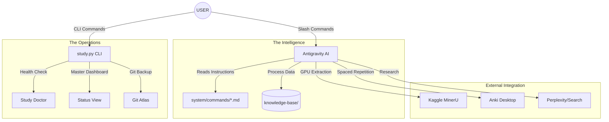
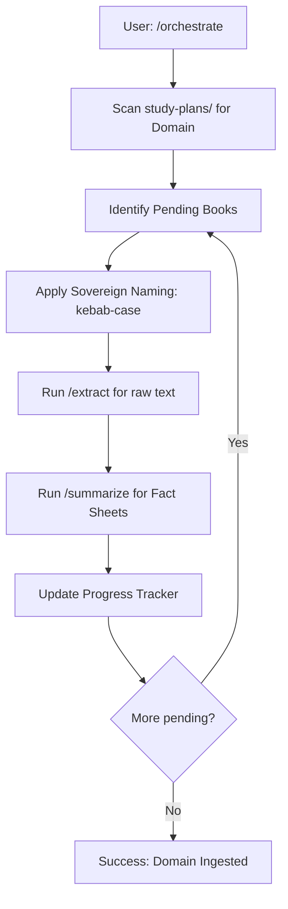
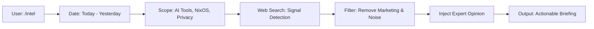
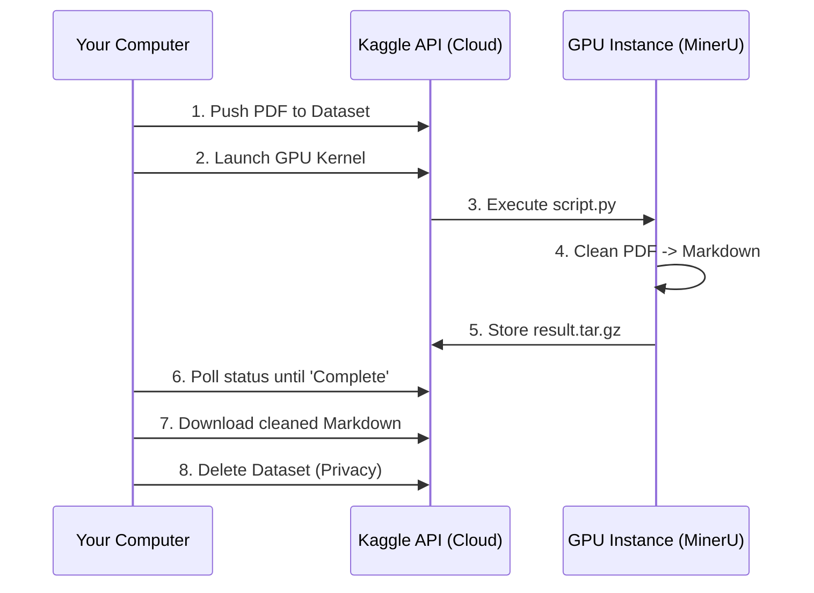

# 🗺️ Master Command & Logic Atlas (v0.1.0)

> "To master the tool, one must first understand the machine."

This document provides a total visual and technical breakdown of every process, command, and skill within the Study System. No more guessing.

---

## 🏗️ 1. Global System Architecture

This diagram shows how the AI Assistant (Antigravity), the CLI Center, and the Filesystem interact to manage your knowledge.

---

## 🕹️ 2. Detailed Command Registry

Every command here is powered by a specific instruction file. Click the link to see the "raw brain" of each skill.

### 🔄 Orchestration Logic (`/orchestrate`)
**Source**: [`system/commands/orchestrate.md`](../system/commands/orchestrate.md)

The "Heartbeat" of the system. It is an autonomous loop that manages your learning queue.

### 📡 Intelligence Logic (`/intel`)
**Source**: [`system/commands/intel.md`](../system/commands/intel.md)

A targeted research sprint designed for high-signal technical updates.

### 🧠 Study & Review Logic
| Command | Source | Process |
|---|---|---|
| `/learn` | [`learn.md`](../system/commands/learn.md) | Socratic tutoring session based on specific chapter content. |
| `/review` | [`review.md`](../system/commands/review.md) | FSRS-driven testing of items marked "DUE NOW" in the dashboard. |
| `/summarize`| [`summarize.md`](../system/commands/summarize.md) | Condensing raw chapters into high-density "Fact Sheets." |
| `/extract` | [`extract.md`](../system/commands/extract.md) | Surgical cleaning of PDF-to-Markdown garble (Math, columns, headers). |

---

## 🧬 3. The Kaggle Foundry (Remote GPU Pipeline)

When you need to process a heavy PDF, the system launches a remote GPU environment to do the heavy lifting.

**Process Flow:**
1.  **Dispatch**: The system uploads your PDF to a private Kaggle Dataset.
2.  **Kernel Launch**: A GPU script (`system/foundry/internal/kaggle-run.sh`) is pushed to run MinerU.
3.  **Extraction**: The GPU performs layout-aware extraction, rejoining broken columns and fixing math.
4.  **Retrieval**: The system polls for completion, pulls the clean `.md` back to your `input-library/`, and deletes the cloud evidence.

---

## 🛠️ 4. Skill/Command Navigation

- **Internal Commands**: Stored in `system/commands/`. Use these in the Antigravity chat.
- **Unified CLI**: Use `./study.py` in your terminal for status and health.
- **Theory Docs**: Stored in `legacy-technical-docs/` for deep-dive research.

---

**Navigation**
[⬅️ Previous: User Manual](USER_MANUAL.md) | [🏠 Home](../README.md)
