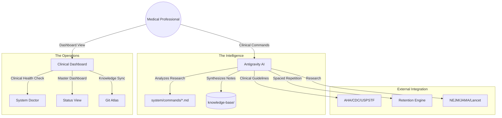
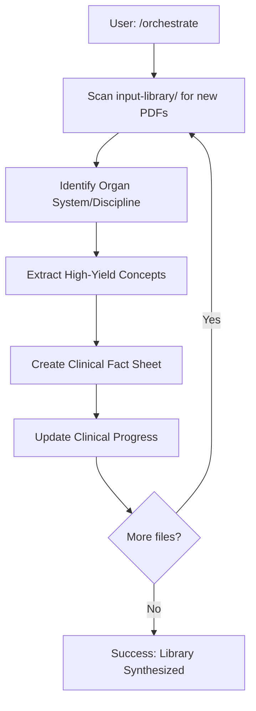
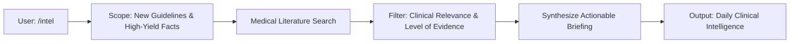

# 🗺️ Clinical Process Map (v0.1.0)

> "The practice of medicine is an art, not a trade; a calling, not a business." — William Osler

This document provides a visual and conceptual map of how your Medical Mastery OS processes clinical knowledge. It is designed to help you understand how your literature is transformed into expertise.

---

## 🏗️ 1. Clinical System Architecture

This diagram shows how your Clinical Research Assistant (Antigravity), the Dashboard, and your Medical Library interact.

---

## 🕹️ 2. Clinical Workflow Registry

Every interaction is guided by professional medical standards. Below is the logic behind your primary tools.

### 🔄 Clinical Orchestration (`/orchestrate`)
**Source**: [`system/commands/orchestrate.md`](../system/commands/orchestrate.md)

The automated process that organizes your incoming medical library.

### 📡 Medical Intelligence (`/intel`)
**Source**: [`system/commands/intel.md`](../system/commands/intel.md)

A daily clinical brief designed to keep you updated with the latest evidence-based medicine.

### 🧠 Deep Learning & Retention
| Command | Clinical Purpose |
|---|---|
| `/learn` | **Clinical Rounds**: Socratic tutoring session based on case studies and pathology. |
| `/review` | **Retention Check**: Spaced repetition for critical facts marked "Review Due." |
| `/summarize`| **Synthesis**: Condensing dense chapters into high-density "Clinical Fact Sheets." |
| `/extract` | **Processing**: Cleaning raw medical text for easier reading and analysis. |

---

## 🧬 3. The Evidence-Based Pipeline

When you add a document to the system, it follows a rigorous path to ensure accuracy:
1.  **Validation**: The system identifies the medical domain (e.g., Cardiology, Renal).
2.  **Extraction**: Key clinical findings, diagnostic criteria, and treatments are identified.
3.  **Cross-Reference**: Concepts are linked to related organ systems or foundational sciences.
4.  **Integration**: Notes are placed in your `knowledge-base/` and scheduled for your next review session.

---

## 🛠️ 4. Navigation

- **Clinical Commands**: Type these directly into the Antigravity chat to manage your learning.
- **Clinical Dashboard**: Use `./study.py status` in your terminal to see your progress at a glance.
- **Medical Library**: Put all your raw documents in `input-library/`.

---

**Navigation**
[⬅️ Previous: User Manual](USER_MANUAL.md) | [🏠 Home](../README.md)
