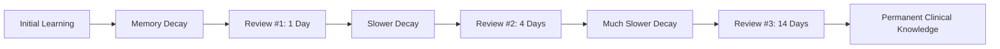

# 🧠 Medical Spaced Repetition: The Science of Retention

> "He who studies medicine without books sails an uncharted sea, but he who studies medicine without patients does not go to sea at all." — William Osler

In medical education, the volume of information is immense. To ensure that high-yield clinical facts are available when you need them—at the bedside or during an exam—this system uses the science of **Spaced Repetition**.

---

## 🔬 1. The Forgetting Curve

Medical knowledge decays over time if not reviewed. Spaced repetition works by scheduling reviews just as you are about to forget a concept, effectively "resetting" your memory and making the knowledge more permanent.

---

## 🛠️ 2. How the System Tracks Mastery

The system monitors your performance during `/review` sessions and `/learn` rounds. It uses a mathematical model to calculate:

1.  **Stability**: How long a medical fact is likely to stay in your memory.
2.  **Mastery Level**: A percentage representing your confidence and accuracy with a topic.
3.  **Next Review Date**: The optimal time to test you again.

---

## 🩺 3. Clinical Application

Your **Clinical Dashboard** (`./study.py status`) shows your current mastery across different medical domains. 

- **Green (Mastered)**: These concepts are stable.
- **Yellow (Reviewing)**: You are actively strengthening these memories.
- **Red (Review Due)**: These facts are at risk of being forgotten. **Prioritize these sessions.**

---

## 🚀 4. Best Practices for Medical Students

*   **Active Recall**: When prompted during a review, try to explain the *pathophysiology* out loud before looking at the answer.
*   **Consistency**: A 10-minute review every morning is more effective than a 5-hour "cram" session once a week.
*   **Case Integration**: Try to relate every fact sheet to a patient you have seen or a clinical vignette you have read.

---

**Navigation**
[⬅️ Previous: Clinical Process Map](COMMAND_ATLAS.md) | [🏠 Home](../README.md)
