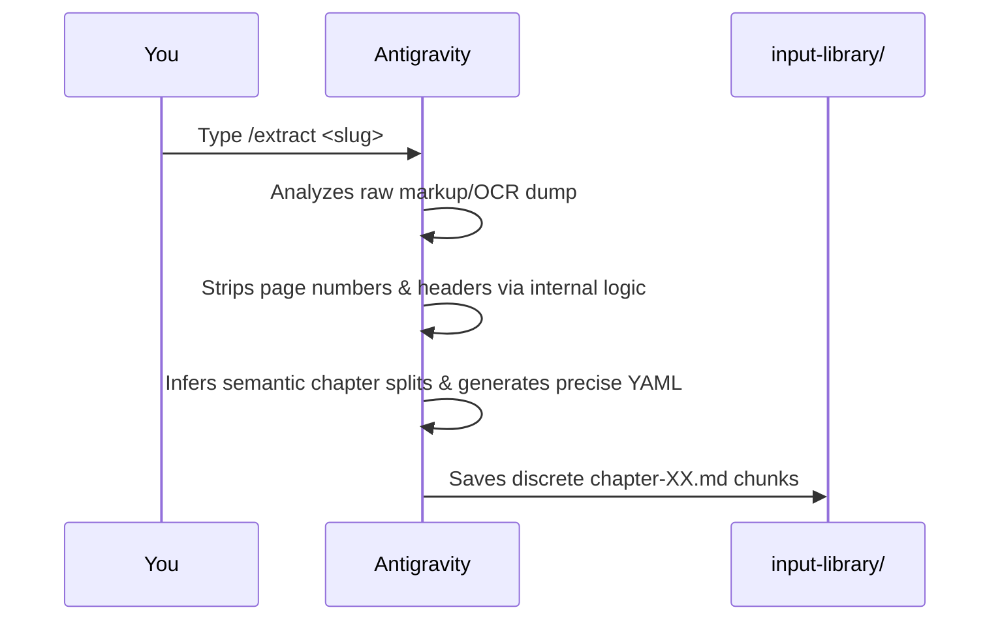

# system/foundry — The Extraction Engine

The Foundry was historically a self-contained, deterministic pipeline of Python execution loops. With **Learning OS v0.1.0**, it has been entirely superseded by Antigravity's native agentic extraction.

## 🚀 Native Agentic Extraction

All PDF processing, OCR text chunking, layout scrubbing, and metadata generation is now managed natively by Antigravity.

### The `/extract` Protocol

**Workflow Instructions:**
Instead of fighting brittle regex loops (`sanitize.py`):
1. Provide the initial raw text drop to `input-library/`.
2. Tell Antigravity to `/extract <slug>`.
3. Stand back as the agent correctly chunks the files, parses out artifacts, generates `chapter-XX.md` nodes, and formally maps the `prerequisites` dynamically via context comprehension.

Once extraction is complete, pipe the resulting chunks directly to `/verify <slug>` for Quality Assurance prior to your study sessions.

---
**Navigation**
[⬅️ Previous: Security Protocol](../../docs/SECURITY.md) | [🏠 Home](../../README.md) | [Next: Environment Core ➡️](../../system/core/README.md)
